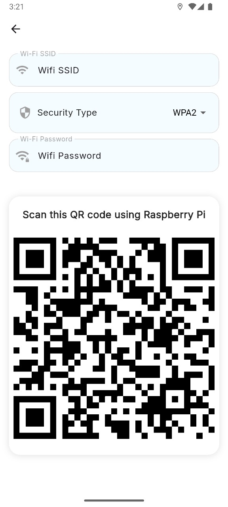

# Ru2ya

A Flutter application designed to assist visually impaired users and their caregivers. The app enables real-time location sharing, device management, and easy Wi-Fi setup using QR codes.

## Features

- **Role Selection:** Choose between Caregiver and Impaired user roles on launch.
- **Caregiver Dashboard:**
  - View and manage paired smart devices (e.g., smart glasses).
  - Monitor device status (battery, temperature, Wi-Fi connection).
  - Access real-time updates from assigned users.
- **Impaired User Experience:**
  - Share real-time location with caregivers (with permission).
  - Generate Wi-Fi QR codes for easy device setup.
  - Simple, accessible interface.
- **Notifications:**
  - Receive push notifications for important events.
  - Local notifications for real-time alerts.
- **Firebase Integration:**
  - Uses Firebase Authentication, Firestore, and Messaging for secure, real-time data.

## Screenshots

| Welcome Screen | Caregiver Dashboard | Glasses Device | QR Code Generator |
|:--------------:|:------------------:|:--------------:|:-----------------:|
|  |  |  |  |

## Getting Started

### Prerequisites
- [Flutter SDK](https://flutter.dev/docs/get-started/install)
- [Firebase CLI](https://firebase.google.com/docs/cli) (for Firebase setup)
- A configured Firebase project (see below)

### Installation
1. **Clone the repository:**
   ```bash
   git clone <your-repo-url>
   cd ru2ya
   ```
2. **Install dependencies:**
   ```bash
   flutter pub get
   ```
3. **Firebase Setup:**
   - Add your `google-services.json` (Android) and `GoogleService-Info.plist` (iOS) to the respective platform folders.
   - Update `firebase_options.dart` if needed (generated by FlutterFire CLI).

4. **Run the app:**
   ```bash
   flutter run
   ```

## Usage

- On launch, select your role:
  - **Caregiver:**
    - View paired devices and their status.
    - Tap a device for more details.
  - **Impaired:**
    - Location is shared automatically (with permission).
    - Generate a Wi-Fi QR code for device setup.

## Project Structure

- `lib/main.dart` – App entry point, Firebase and notification setup.
- `lib/pages/` – Main screens:
  - `welcome.dart` – Role selection screen.
  - `devices.dart` – Caregiver dashboard.
  - `impaired.dart` – Impaired user dashboard.
  - `qr_connection.dart` – Wi-Fi QR code generator.
  - ...and more.
- `assets/` – App images and icons.

## Dependencies

Key packages:
- `firebase_core`, `cloud_firestore`, `firebase_messaging`, `flutter_local_notifications`
- `google_maps_flutter`, `geolocator`, `permission_handler`
- `flutter_riverpod`, `bloc`, `flutter_bloc`
- `qr_flutter`, `network_info_plus`, `device_info_plus`

See `pubspec.yaml` for the full list.

## Contributing
Pull requests are welcome! For major changes, please open an issue first to discuss what you would like to change.

## License
[MIT](LICENSE) (or specify your license here)
